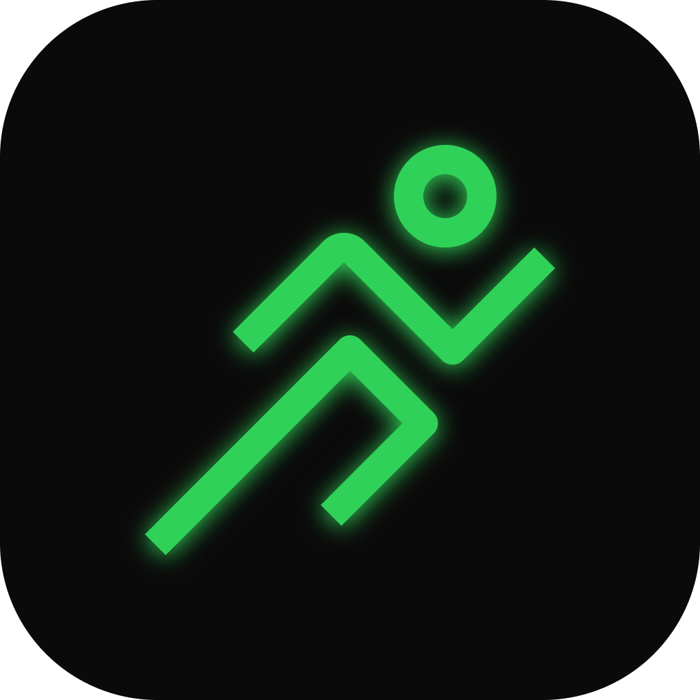

<div align="center">



<br/>
<br/>

# Euexia

**Native Android health tracker — React + Vite + Capacitor**

A production-grade personal health tracking app with a custom native
Android foreground service for true background step counting.


<br/>

> 🚧 **Active development — Play Store launch coming soon**

</div>

---

## What is Euexia?

Euexia is a personal health tracking Android app built solo from scratch. It started as a learning project in React + Capacitor and evolved into a production-grade app with a custom native step-counting system built entirely in Java.

The name *Euexia* (εὐεξία) is an ancient Greek word meaning *"a state of good health and physical wellbeing."*

> Source code is private pending Play Store launch.
> The native Android architecture is visible below.

---


## Features

| Feature | Details |
|---|---|
| **Native Background Step Counting** | Custom Java foreground service (`START_STICKY`) reads `Sensor.TYPE_STEP_COUNTER` directly — steps counted even when app is fully closed and swiped away |
| **Smart Day Rollover** | Daily step count resets at 5:00 AM natively in Java — handled even while the app is closed |
| **Cloud Sync** | All health data syncs to Supabase every 30s, restores on login across devices |
| **Water Tracker** | Daily hydration logging with per-glass progress bar and goal-reached celebration |
| **Workout Log** | 35+ exercises with MET-based calorie calculation and intelligent double-count protection for phone-carried cardio |
| **Streak System** | Daily goal tracking with streak counter and celebration animation |
| **Weekly Summary** | Rolling 7-day breakdown with per-day stats |
| **Profile** | Personal stats (name, age, height, weight) synced to Supabase — weight feeds the MET-based calorie math |
| **Customizable Goals** | Per-metric daily targets (steps, water, calories) with range validation, editable in Settings |
| **Push Notifications** | Water reminders, step nudges, streak alerts — local, no server needed |
| **Dark / Light Theme** | Full CSS variable theming, toggle in Settings |

---

## Tech Stack


| Layer | Technology |
|---|---|
| Frontend | React 19 + Vite 8 |
| Mobile Bridge | Capacitor 8 (Android) |
| Native Plugin | Custom Java Foreground Service + Capacitor Bridge |
| Backend | Supabase (Postgres + Auth) |
| Auth | Supabase email/password + native Google sign-in (`@capgo/capacitor-social-login`) |
| Notifications | `@capacitor/local-notifications` |
| Live Updates | OTA bundle updates via `@capgo/capacitor-updater` |
| Animation | Framer Motion + `@react-spring/web` |
| Icons | lucide-react |
| Styling | Plain CSS3 + CSS variables — no Tailwind |

---

## Native Architecture

The step counting system is the core technical achievement of this project. Most React + Capacitor health apps rely entirely on Google Fit. Euexia uses custom Java plugins backed by a persistent foreground service that reads the hardware sensor directly.

```
android/app/src/main/java/com/euexia/app/
│
├── MainActivity.java
│   ├── Registers StepSensor, AuthBridge & Google SocialLogin plugins
│   ├── Requests ACTIVITY_RECOGNITION (Android 10+) & POST_NOTIFICATIONS (Android 13+) at runtime
│   └── Starts BackgroundStepService once the user is logged in + permission granted
│
├── BackgroundStepService.java
│   ├── Android Foreground Service (START_STICKY)
│   ├── Registers Sensor.TYPE_STEP_COUNTER (falls back to TYPE_STEP_DETECTOR on OEMs where it won't register)
│   ├── Persists daily step delta to SharedPreferences on every sensor event
│   ├── Handles day rollover at 5:00 AM (even while app is closed)
│   ├── Handles device reboot (sensor value reset to 0)
│   └── Auto-restarts if killed by Android — no steps ever missed
│
├── StepSensorPlugin.java
│   ├── Capacitor JS bridge — name: "StepSensor"
│   ├── Exposes getSteps() / setSteps() to React
│   └── Reads from SharedPreferences — fully decoupled from sensor lifecycle
│
└── AuthBridgePlugin.java
    ├── Capacitor JS bridge — name: "AuthBridge"
    ├── Persists login state to SharedPreferences
    └── Starts the step service on login, stops it on logout
```

**Why this matters:**

Android's hardware step-counter sensor runs at the firmware/sensor-hub level continuously. The foreground service reads it and persists the daily delta — so when the user reopens the app, the accurate count is already waiting. No background polling, no battery drain, no missed steps.

---

## How the JS Layer Uses It

```jsx
// StepCounter.jsx
const StepSensor = Capacitor.isNativePlatform()
  ? registerPlugin("StepSensor")
  : null;

// Polls every 5 seconds while app is in foreground
const interval = setInterval(async () => {
  const result = await StepSensor.getSteps();
  setSteps(result.value);
}, 5000);

// Instant refresh when user switches back to app
document.addEventListener("visibilitychange", () => {
  if (document.visibilityState === "visible") fetchNativeSteps();
});
```

---

## Project Status

| Milestone | Status |
|---|---|
| Core health tracking (steps, water, workouts, streaks) | ✅ Complete |
| Native Android foreground service | ✅ Complete |
| Supabase cloud sync | ✅ Complete |
| Over-the-air (OTA) updates via Capgo | ✅ Complete |
| Push notifications | ✅ Complete |
| Dark / Light theme | ✅ Complete |
| Custom app icon + notification icon | ✅ Complete |
| Play Store release | 🚧 In progress |
| iOS support | 📋 Planned |
| Home screen widget | 📋 Planned |

---

## Why Source is Private

This is a **portfolio showcase**, not an open source project.

The full React source will remain private until after the Play Store launch. The native Android plugin (`android/` folder) is visible as a demonstration of the architecture and native integration work.

---

## License

Copyright © 2026 Tushar Beckham. All rights reserved.

This repository is publicly visible for portfolio purposes only. Copying, forking, or using this code in your own projects is not permitted. See `LICENSE` for full terms.

---

<div align="center">

Built solo by <a href="https://github.com/tusharbeckham">Tushar Beckham</a>
<br/>
⭐ Star this repo if you found the native step tracking approach useful

</div>